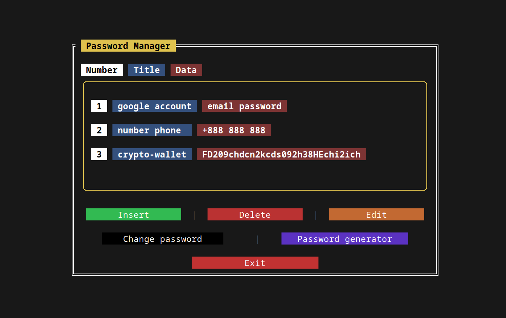

# **EPSE** 
### ***Encryption-Protection-Storage-Exchange***
> More than a password manager

## Linux CLI
### Description
* To work, you need to register by creating a password for further login
* In the program, everything is divided into blocks, a block has a name and data, each data has a name
* The name and/or data can be any
* Data and/or names can be edited, deleted, added
* Generating a password of any length
* Changing the password to log in to the program

### Attention! 
When registering or logging in, the database (local) is encrypted and decrypted each time. Upon successful login, the database will be decrypted and you will be able to add your data to it. If unsuccessful (up to 10 attempts), as after 10 attempts, the database will be deleted and you will lose data forever. 

If you press the keyboard shortcut **"CTRL + C"**, if you entered the program before, then after clicking the **database is not encrypted**, you need to re-enter and exit (by pressing the exit key).

**_P.s. I will fix this in the future._** :-)

