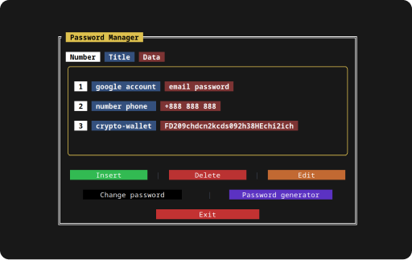

#  **EPSE**
### ***Encryption-Protection-Storage-Exchange***
> More than a password manager

#  Linux CLI 
### **Description**
* To work, you need to register by creating a password for further login
* In the program, everything is divided into blocks, a block has a name and data, each data has a name
* The name and/or data can be any
* Data and/or names can be edited, deleted, added
* Generating a password of any length
* Changing the password to log in to the program
* 10 attempts to log in, otherwise deleting the database

##  Build
### Dependencies
* `pip install pytermgui` — TUI for terminal(console)
* `pip install pyperclip` — to copy passwords/usernames and other data
* `pip install cryptography` — to encrypt the database
* `pip install nuitka` — for compiling from sources

### Compilation
`nuitka --follow-imports windows.py`
or your other compiler

##  Using a ready-made program
Remove the **"epse"** binary file from the **CLI/Linux/bin** directory and move it to the **/usr/bin/** directory or the directory for binary files of your system.

### Screenshot

##  <a href='https://github.com/watocmasc/PasswordManagerEPSE/archive/refs/heads/main.zip'>Download the sources right now</a>
