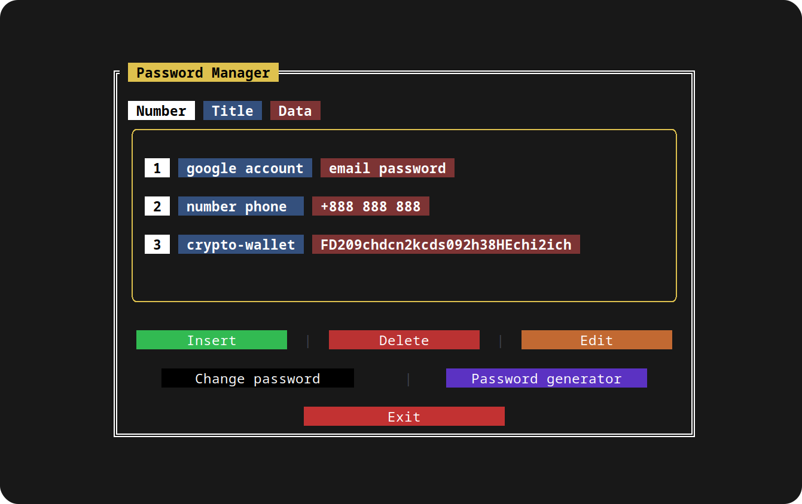
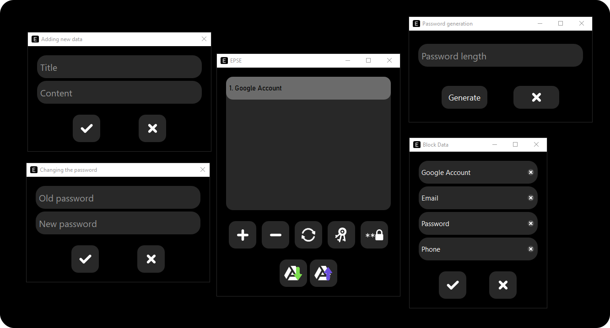

#  **EPSE**
### ***Encryption-Protection-Storage-Exchange***
> More than a password manager

#  Linux CLI 
### **Description**
* To work, you need to register by creating a password for further login
* In the program, everything is divided into blocks, a block has a name and data, each data has a name
* The name and/or data can be any
* Data and/or names can be edited, deleted, added
* Generating a password of any length
* Changing the password to log in to the program
* 10 attempts to log in, otherwise deleting the database

##  Build
### Dependencies
* `pip install pytermgui` — TUI for terminal(console)
* `pip install pyperclip` — to copy passwords/usernames and other data
* `pip install cryptography` — to encrypt the database
* `pip install nuitka` — for compiling from sources

### Compilation
`nuitka --follow-imports windows.py`
or your other compiler

##  Using a ready-made program
Remove the **"epse"** binary file from the **CLI/Linux/bin** directory and move it to the **/usr/bin/** directory or the directory for binary files of your system.

### Overview

#  EPSE Desktop 
### **Description**
* To work, you need to register by creating a password for further login
* In the program, everything is divided into blocks, a block has a name and data, each data has a name
* The name and/or data can be any
* Data and/or names can be edited, deleted, added
* Generating a password of any length
* Changing the password to log in to the program
* You can create and/or upload a backup in your Google Drive

##  Build
### Dependencies
* `pip install json` — to work with the database
* `pip install pyside6` — GUI of the entire application
* `pip install cryptography` — to encrypt the database
* `pip install pydrive` — to work with Google Drive cloud storage
* `pip install nuitka` — for compiling from sources

### Compilation
`nuitka --windows-disable-console --output-dir=bin --follow-imports --output-file="epse-desktop" --windows-icon-from-ico="C:\Users\Watoc\PasswordManagerEPSE\Desktop\Windows\img\icon_main_window.ico" --remove-output --jobs=4 epse_desktop.py` for Windows
or your other compiler

`python -m nuitka --output-dir=bin --output-file="epse-desktop" --linux-icon="img/icon_main_window.ico" --remove-output --follow-imports --jobs=4 epse_desktop.py` for Linux
or your other compiler

##  Using a ready-made program
Your database can be located either locally on your computer or cloud-based in storage
To use Google Drive cloud storage, you need to set up everything you need on this site <a href="https://console.cloud.google.com/">Google Cloud</a>
#### **For Windows:** all files must be in the same directory, along with the binary file
#### **For Linux:** you need to create an epse-config folder in the `.config` directory and transfer all files there, along with the binary file

### Overview

##  <a href='https://github.com/watocmasc/PasswordManagerEPSE/archive/refs/heads/main.zip'>Download the sources right now</a>
